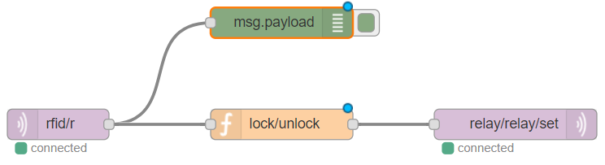
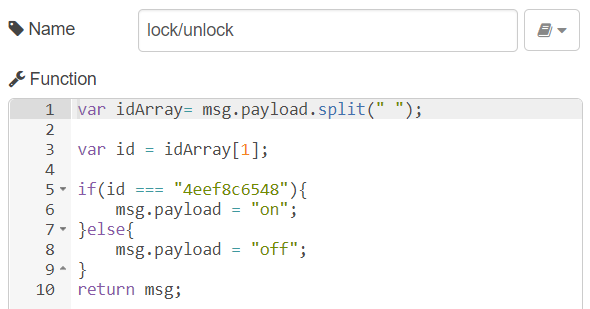
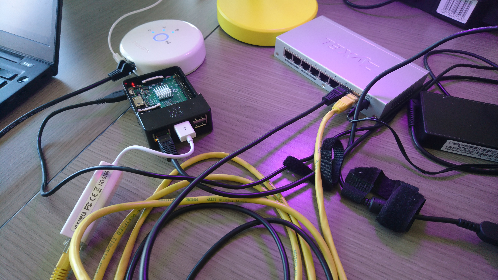
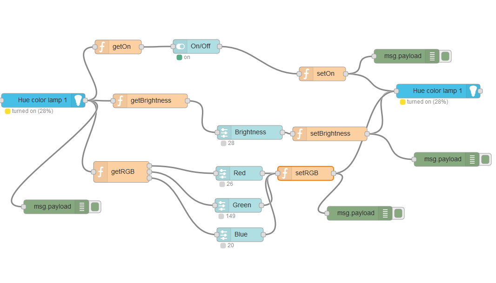
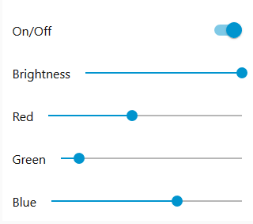
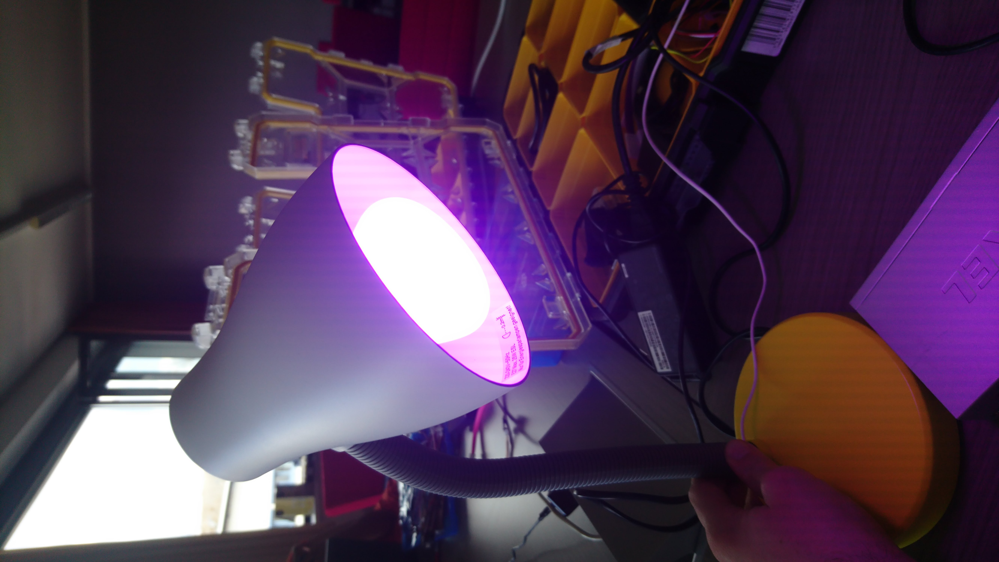
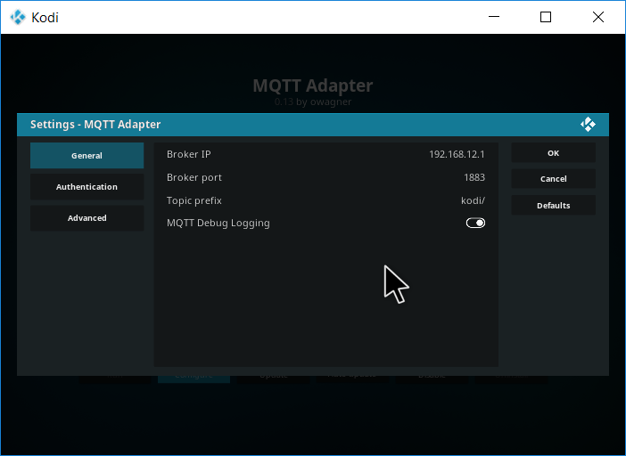
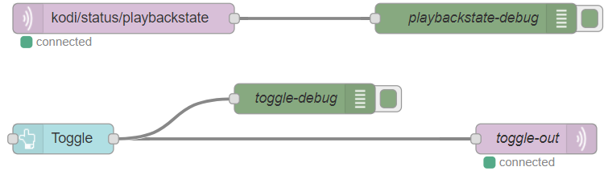
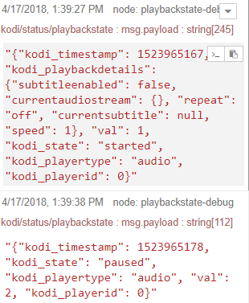
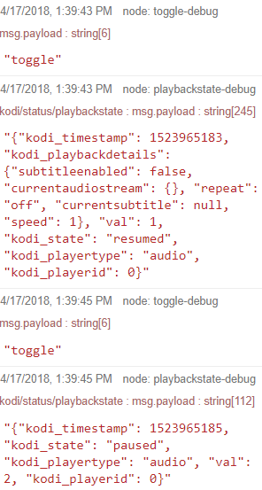

# 19.03.2018
## Project setup
* Set up project team (Codename: MC-Guys)
* Set up git repo on GitHub with all access rights for members
	* Every team member has own folder with its own portfolio
	* Providing a central protocol as a technical documentation
	* The portfolio of each member gives a personal insight of the tasks done in the lecture

## UlnoIoT environment setup
### Raspberry
* WFollowing the tutorial on https://github.com/ulno/ulnoiot#installation
* Download pi image from repo
* Flash SD-Card with Etcher (https://etcher.io/)
* On file system, check config file and change Wifi-SSD and password for each Pi
	* pattern: SSID: mc_guys_[nr], password: mcguys***
* Boot raspberry
* Connect to configured Wifi
* Connect to Pi via SSH agent (Windows: MobaXTerm (https://mobaxterm.mobatek.net/), Mac/Linux: Console) via `ssh -x pi@192.168.12.1`
* Change password: Same as Wifi password
* Update UlnoIoT framework via `ulnoiot upgrade`
* Expand harddisk via `raspi-config`


### IoT nodes
* Following the tutorial on https://github.com/ulno/ulnoiot#first-iot-nodes
* After initialization, plug in to other computer, wait for bootup (30s)
* On Pi, connect to node via `console`
* Testing onboard led locally
```
onboardled.init( Pin.OUT )
onboardled.on()
onboardled.off()
onboardled.on()
```

* Turn on/off onboard led via MQTT
	* define a device via `d("led","blue",onboardled, "on", "off")`. This also defines a MQTT-topic which the node continuously listens to. Topic name: *[node_name]/[devicename]/set*
	* running node via `run()`
	* Test MQTT-sending on the Pi (not in console) via `mqtt_send [node_name]/[devicename]/set [on/off]`

# 22.03.2018
## UlnoIoT Hello World
Trigger a led of one node with a button press of another one.
* create a new node on Pi 
* flash on node
* connect to it and define button: `d("button", "button1", d1, "on", "off")`, continuously publishing to MQTT-topic  
* Run node via `run()`
* MQTT-forwarding mechanism on Pi, e.g. `mqtt_action button_blinker/button1 anychange [some-name] mqqt_send onbard_blinker/blue/set`
* Button press now triggers led
* To enable plug&play, we have to setup some configuration in the *autostart* file. To find in the node folder on the Pi.
	* Writing commands for defining devide (d-command) and run-command inside file.
	* Deploy autostart file to node via `deploy` in node folder


## Relay
Trigger a lock (12V) with a relay controlled by a button.
* Button already set up
* Wiring up relay with lock, relay needs 12V (not sure, using separate power adpater) and plug in in relay with node
* register device relay `d("out", "relay", d2)`
* testing locally `device["relay].evaluate["on"]`
* testing MQTT on Pi `mqtt_send relay/set on`

# 23.03.2018
## Control servo/lock vai a RFID-reader
* Create and flash new node
* Wire up RFID following instructions on (https://github.com/ulno/ulnoiot/blob/f64b72f320a11c42b93f8c53222fdaaf404fe221/doc/wiring-mfrc522.txt)
* Create device via `r=d("mfrc522","r",d0)`
* Write data to a mifare classic card `r.write("hello from hagenberg")`, continously publishing on MQTT-topic, e.g. *[node-name]/[devicename]*
* Run node `run()`
* Because the RFID tag delivers an ID and we want to check for the "right" card, we must need some logic to filter out MQTT-Messages. Using Node-RED (https://nodered.org/)
* Node-Red is already installed on the Pi, connect to it (http://192.168.12.1:1880/)
* Create a new Flow filtering out the ID, and manipulate message payload to on/off.
	* 
	* 


## Showing temp/humidity on LCD-display
* Create node on Pi for temp/humidity (single node because of combined sensor) and flash
* Create node on Pi for LCD and flash
* Temp/humidity
	* Testing values via Node-Red UI component
* LCD-node
	* Following tutorial on https://github.com/ulno/ulnoiot/blob/master/doc/node_help/display44780.txt to setup all correctly.
	* Testing node via MQTT, send message, should be displayed on LCD
* Configure MQTT action for forwarding via Node-Red
	
	
# 03.04.2018
Home and building automation discussion round with pro, con (us) and a moderator team about certain topics.
	
# 10.04.2018
## KNX certificate
In order to get familiar with KNX bus protocol, we made the KNX-certificate couse on https://www.knx.org/knx-en/training/knx-eacademy/ets-ecampus/index.php.

Steps to take
* Sign up to KNX eCampus (free)
* Do the basic certificates course
* Get a certificate (at least 90%)

Individual certificates can be found in every persons private folder.


## MQTT simulator
Goal of this exercise is to "program" an MQTT-simulator. We can either program it by ourselves, or use node-RED using the dashboard.

Because of time savings, we used node-RED for that task.

* Download node-RED to the computer via npm `npm install -g --unsafe-pem node-red`
* Download node-RED dashboard via `npm install node-red-dashboard`
* Set up some UI-elements which sends commands (some kind of simulator)

# 10.04.2018/17.04.2018
## Philips HUE lamps
In order to connect an ethernet device (like hue lamps) and connect to a local network, the Pi must use a separate (wifi) connection to get internet access again. We have an wifi-usb-adapter, so we go for that one.

* Connect to pi wifi, connect via ssh
* Enable wifi inputs (use `sudo` commands)
	* in boot/config.txt uncomment and change uiot_wifi_name=fhhgb-guest and uiot_wifi_password=AIF533EAy504CF
* Enable access point bridge
	* in ulnoiot/etc/ulnoiot.conf uncomment ulnoiot_ap_bridge=eth0
* Plug in wifi-usb-adapter into Pi, conect the hue bridge via the ethernet port and reboot the Pi
	* Pi should now connect to specified wifi and provide a working internet connection
* Get list of all connected devices `arp -n` 
* We have some problems with the internet connection, so we tried the hue app on Android to check if we can find the hue bridge
	* App finds hue lamp
	* After updating the bridge with the app, we get the the IP-address of the bridge 92.168.12.69
	* We can control the hue lamp remotely from our computer, guide provided here: https://www.developers.meethue.com/documentation/getting-started
* Fixing internet issues on Pi (temporary, not working!)
	* `sudo iptables -t nat -D POSTROUTING 1; sudo iptables -t nat -A POSTROUTING -s 192.168.12.1/24 -o wlan1 -j MASQUERADE`
* We stop here and wait for a solution from our professor

* Next try with new setup, updated ulnoiot on the Pi, getting a switch and a USB-LAN adapter.
* Updated config files (see above)
* After reboot, connect Pi with USB-LAN adapter and LAN to switch, and the switch with the hue-bridge via LAN.
* Connect to Pi, load package node-red-contrib-huemagic in the node-RED interface including different HueMagic nodes.
* Setup the lamp
	* Include Hue Light node
	* Select bridge inside node (tap on bridge to activate)
	* Select light (Hue color lamp 1)
* Build up node-Red configuration depending on your use-case, e.g. build a dashboard on node-red to control Hue lamp
* 
* 
* 
* 

## Distance sensor/Motion Detector

Goal is to implement a Motion Detector with the ultrasonic distance sensor

* First create a new Node for the distance sensor
* connect the sensor correctly: d2 = trigger, d1 = echo
* In the node Terminal create new device: d("hcsr04", "distance", d2, d1, precision=10
* now the sensor broadcasts on the created topic
* use NodeRed to listen on the MQTT topic and create a function that sets an alarm when a specific threshold is crossed (we defined thershold<300 for testing)

## Kodi
> Kodi (formerly XBMC) is a free and open-source media player software application developed by the XBMC Foundation - Wikipedia

Goal is to control Kodi over MQTT and node-RED.

* Download Kodi and install Kodi (https://kodi.tv/download)
* Using node-RED plugin
	* e.g. node-red-contrib-kodi via `npm install node-red-contrib-kodi`
	* Adds nodes to node-RED, uses RPC (JSON-format) to control Kodi instance.
* Using Kodi-AddOn
	* e.g. Kodi2MQTT (https://github.com/owagner/kodi2mqtt)
	* Download, load into <kodi-install-path>/addons/
	* Enable addon
		* Start Kodi
		* Go to Add-ons/My add-ons/Services
		* Change some basic settings, e.g. MQTT-broker ip, port, etc., e.g. 

	* Build nodes in node-RED (available topics see https://github.com/owagner/kodi2mqtt#topics)
	* Node-Red configuration

	* Kodi player sends now commands to the topic and can be toggled via the UI-button
	* Kodi sends commands when toggle play/pause

	* Kodi toggle via the UI-button

